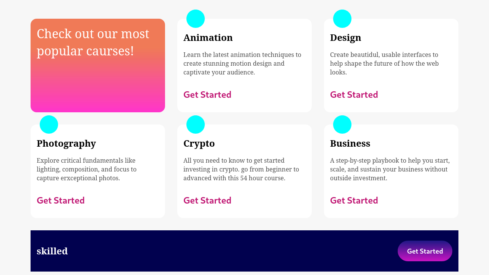
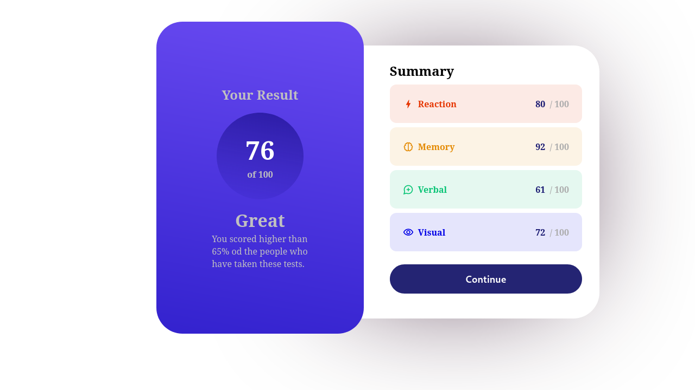
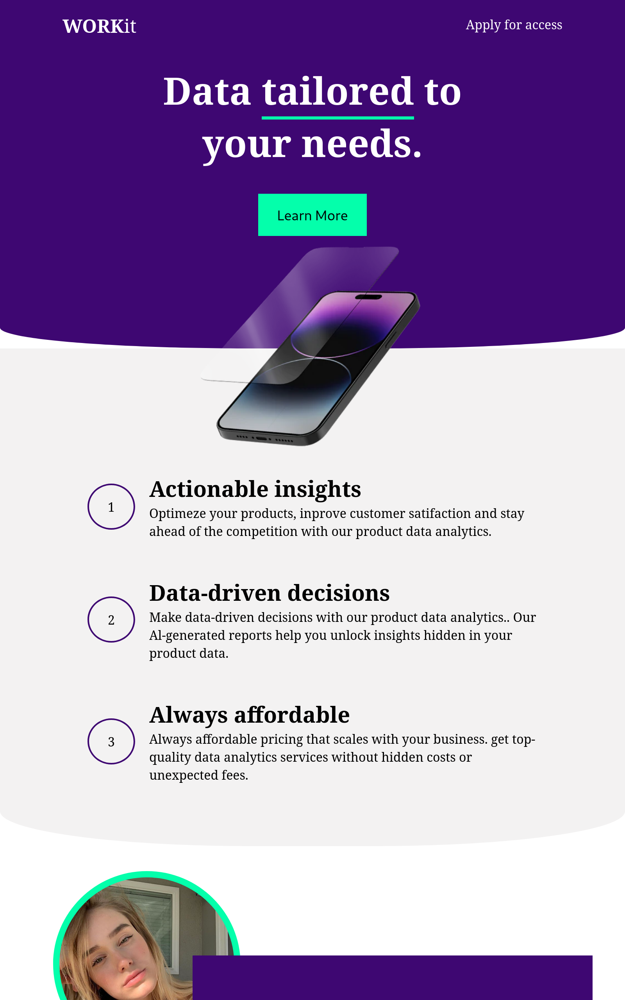
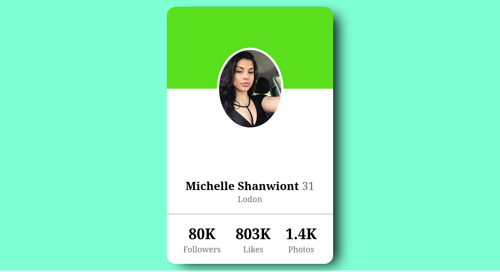

# Newbie Challenges

Challenges for Beginner Frontend Developers | Desafios para desenvolvedores Frontend iniciantes

Autor: Dev Meditation

## Project 001: Product Previwe Card

## Project 002: Skilled e-learning landing page

## Project 003: Results summary component

## Project 004: Workit Langing Page

## Project 005: Profile Card

## Project 006: Stats preview card

## Project 007: SHIP WS ON BOARD FLORIDA

### TECHS AND LIBS

- [ReactJs]()
- [ViteJS]()
- [React Icons]()
- [TypeScript]()

### CONTACT

- [BCL-LAB](https://youtube.com/@bcllab)